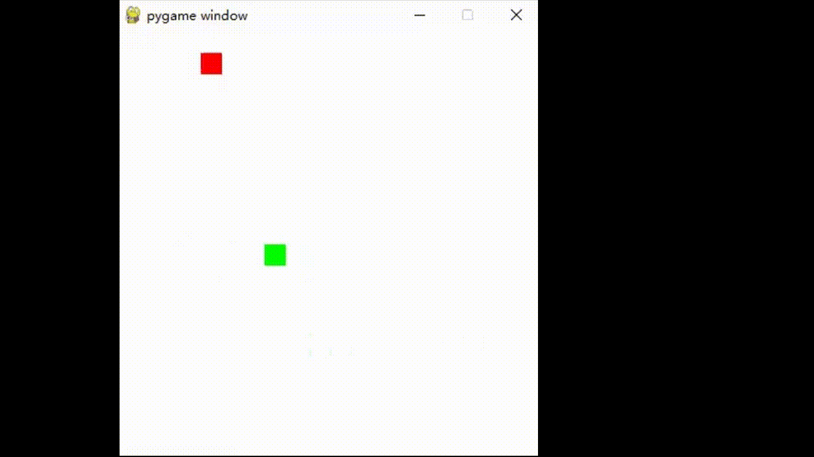

# Q-Learning Snake Game

This project implements a simple Snake game using Pygame and a Q-Learning agent to train the snake to play the game autonomously. The Q-Learning algorithm is a popular reinforcement learning technique that enables the agent to learn optimal actions by interacting with the environment.

## Table of Contents
- [Introduction](#introduction)
- [Features](#features)
- [Installation](#installation)
- [Usage](#usage)
- [Code Overview](#code-overview)
- [Future Improvements](#future-improvements)
- [Contributing](#contributing)
- [License](#license)

## Introduction

The goal of this project is to demonstrate the application of reinforcement learning in a simple environment. The snake learns to navigate the grid, avoid collisions, and consume food to maximize its score.



## Features

- **Q-Learning Algorithm**: The Q-Learning agent learns by exploring the game environment and receiving rewards or penalties based on its actions.
- **Pygame Visualization**: The game environment is visualized using Pygame, providing a graphical interface to observe the learning process.
- **Customizable Parameters**: The learning rate, discount factor, epsilon decay, and other parameters are customizable to fine-tune the learning process.

## Installation

1. **Clone the Repository**:
   ```bash
   git clone https://github.com/yourusername/qlearning-snake-game.git
   cd qlearning-snake-game
   ```

2. **Install Dependencies**:
   Ensure you have Python installed, then install the required packages using pip:
   ```bash
   pip install numpy pygame
   ```

3. **Run the Game**:
   ```bash
   python main.py
   ```

## Usage

The game will start running, and you will observe the snake moving around the grid. The Q-Learning agent will explore different actions, and over time, it will learn to play the game more effectively. The console will display the total reward for each episode.

## Code Overview

### QLearningAgent Class

This class implements the Q-Learning algorithm, handling the following tasks:
- **Choosing Actions**: The agent selects actions based on the epsilon-greedy policy, balancing exploration and exploitation.
- **Updating Q-Values**: The agent updates its Q-table based on the rewards received from the environment.
- **Decaying Epsilon**: The epsilon value decays over time to reduce exploration as the agent learns.

### SnakeGame Class

This class manages the game environment, including:
- **Resetting the Game**: Initializes the snake, food, and other game variables.
- **Spawning Food**: Places food in random positions on the grid.
- **Stepping Through the Game**: Updates the game state based on the agent's actions.
- **Rendering the Game**: Visualizes the game using Pygame.

### Main Function

The main function initializes the game and the Q-Learning agent, runs multiple episodes of the game, and updates the agent's Q-values based on its experiences.

## Future Improvements

- **Enhanced State Representation**: Improve the state representation to include more information about the environment, such as distances to obstacles.
- **Reward Shaping**: Fine-tune the reward structure to encourage more strategic behavior.
- **Hyperparameter Tuning**: Experiment with different values for learning rate, discount factor, and epsilon decay to optimize learning.
- **Advanced Algorithms**: Implement more advanced reinforcement learning algorithms like Deep Q-Networks (DQN).

## Contributing

Contributions are welcome! Please feel free to submit a pull request or open an issue to discuss improvements, bug fixes, or new features.

## License

This project is licensed under the MIT License. See the [LICENSE](LICENSE) file for details.

---

Enjoy the game, and happy learning!

---

**Note**: The snake game visualization may run slower due to the inclusion of `time.sleep(0.1)` to make the learning process observable. You can adjust or remove this delay to speed up the game.
